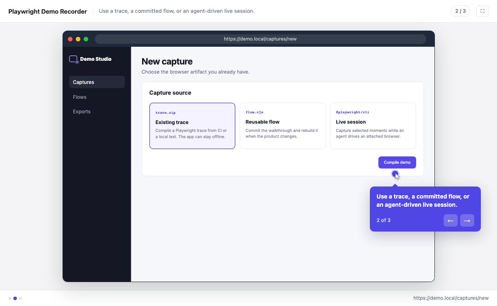
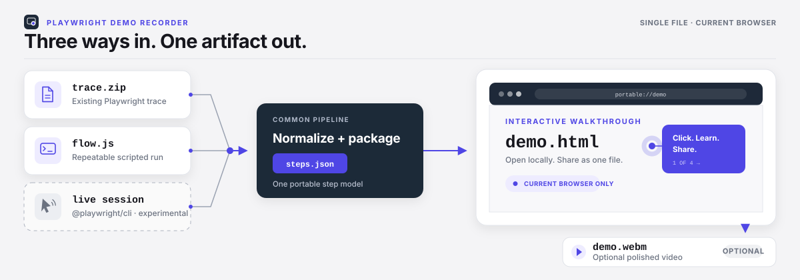

# Playwright Demo Recorder

**An agentic recorder for portable, interactive product demos built from
Playwright.**

Turn an existing `trace.zip`, a committed browser flow, or a live agent session
into one portable, single-file click-through HTML. The same captured steps can
produce a polished WebM with cursor movement, callouts, and clean transitions.

[](https://github.com/dthinkr/playwright-demo-recorder/actions/workflows/ci.yml)

[](LICENSE)



This is the generated `demo.html` player, not a recorder GUI. Its synthetic
walkthrough comes from the bundled sample and uses the production build path.



The person opening the finished `.html` needs a current browser. They do not
need your application, account, server, Node.js, Playwright, or a hosted demo
workspace.

## Try the real player in 30 seconds

The bundled sample builds a three-step interactive demo without launching a
browser or downloading a fixture:

```bash
npm install --save-dev playwright-demo-recorder
npx playwright-demo sample --out ./playwright-demo.html
```

Open `playwright-demo.html` and click through it. The sample uses the same player
and build pipeline as a captured application.

The `sample`, `trace`, and `rebuild` commands do not launch a browser. The
`record` and `video` commands use Chromium. Install it once if the project does
not have a compatible Playwright browser:

```bash
npx playwright install chromium
```

Give a coding agent this prompt when you already have a trace:

> Find the latest Playwright `trace.zip` in this project. Install
> `playwright-demo-recorder`, convert the trace into `out/product-demo.html`,
> and report which actions became steps. Do not publish the trace or demo.

> [!CAUTION]
> A demo contains cloned DOM and application state. Password values are masked
> and URL query strings are removed, but this tool does not anonymize visible
> names, account data, images, or DOM attributes. Use synthetic data and review
> every step before sharing.

## The useful difference

Playwright already produces rich evidence. Agents and CI runs create traces,
tests, and browser sessions as part of normal work. Playwright Demo Recorder
turns those artifacts into a guided product story for someone who cannot run
the project.

| Tool or artifact | Built for | Viewer receives |
|---|---|---|
| Playwright Trace Viewer | Debugging a test run | A detailed engineering trace |
| Screen or demo video | Watching a fixed sequence | A flat video |
| Hosted demo platform | Sales editing, analytics, and hosting | A hosted experience |
| **Playwright Demo Recorder** | Agent output, CI, release proof, and product walkthroughs | A local interactive HTML, rebuildable steps, and optional video |

The project stays local. It needs no recording extension, service account, or
upload step.

## Choose the input you already have

| Route | Use it when | Creator requirements |
|---|---|---|
| **Trace** | A Playwright test or CI run already produced `trace.zip` | Node.js 20+ and `unzip`; the original app can stay offline |
| **Flow** | The walkthrough should live in source control and follow UI changes | Node.js 20+, a reachable app, and Playwright Chromium |
| **Attach** *(experimental)* | An agent is driving an existing browser session and you want to choose moments | The optional `@playwright/cli` package and its live session |

Each route ends at the same player and step format. Start with trace when one is
available. Use a flow for a repeatable product story. Attach remains useful for
live agent work, with more setup and less predictable page timing.

## Route 1: compile an existing trace

Playwright traces contain DOM snapshots before actions, action coordinates,
viewport data, and URLs. Convert one without checking out or running the app
that produced it:

```bash
npx playwright-demo trace test-results/example/trace.zip \
  --out out/onboarding \
  --title "Product onboarding"
```

This writes `out/onboarding.html` and `out/onboarding-steps.json`. Render a
video from the player when a flat format is useful:

```bash
npx playwright-demo video out/onboarding.html
```

The trace must include snapshots. Playwright Test trace modes do this. Custom
tracing should call `tracing.start({ snapshots: true })`.

Trace conversion calls the Unix `unzip` command. macOS and most Linux systems
include it. Windows users can install Info-ZIP or run this route in WSL. The CLI
reports a missing prerequisite before reading the trace.

## Route 2: commit a reusable flow

A flow exports `{ title, viewport?, run(rec, page) }` from a CommonJS file:

```js
const baseUrl = process.env.DEMO_BASE_URL || 'https://example.com';

module.exports = {
  title: 'Example walkthrough',
  viewport: { width: 1440, height: 900 },
  async run(rec, page) {
    await rec.goto(baseUrl, 'Open the product page.');
    await rec.click('a', 'Follow the highlighted link.');
    await page.waitForLoadState('domcontentloaded');
    await rec.note('The destination is ready.');
  },
};
```

Run the packaged [basic flow](examples/basic-flow.cjs):

```bash
DEMO_BASE_URL=https://your-demo-app.example \
  npx playwright-demo record ./node_modules/playwright-demo-recorder/examples/basic-flow.cjs \
  --out out/onboarding
```

`rec.click()` and `rec.type()` capture the state before an action and attach a
hotspot to its target. `rec.note()` captures a result state without a hotspot.

`record` creates the interactive demo, its steps, a Playwright trace, and a
polished video:

| Output | Purpose |
|---|---|
| `<base>.html` | Portable interactive walkthrough |
| `<base>-steps.json` | Capture data for restyling or rebuilding |
| `<base>-trace.zip` | Original trace for debugging or reconversion |
| `<base>.webm` | Video rendered from the finished player |

Use `--no-video` for an HTML-only run. Add `--raw-video` when you also need the
unpolished browser recording. Raw recording consumes more time and disk space,
so the recorder leaves it off by default.

## Route 3: attach to a live agent session

Attach mode uses the separate `playwright-cli` executable. The standard
Playwright package and Playwright MCP do not provide that executable. Install
the optional prerequisite in the project:

```bash
npm install --save-dev @playwright/cli
```

Start a named session. Auto mode watches clicks and page arrivals:

```bash
npx playwright-cli -s=view open https://your-demo-app.example
npx playwright-demo attach auto --session view --out out/my-demo --title "My demo"
# Browse in the session, then run this in another terminal:
npx playwright-demo attach finish
```

Manual mode lets the operator choose steps and captions:

```bash
npx playwright-demo attach start --session view --out out/my-demo --title "My demo"
npx playwright-demo attach snap --say "Click Issues" --at "a[href$='/issues']"
npx playwright-demo attach snap --say "The list loads here"
npx playwright-demo attach finish
```

Attach state files (`.session.json` and `.stop`) live in the caller's project.
Run commands for one recording from the same directory.

A click that causes immediate navigation can destroy the page context before
auto mode captures the pre-click frame. The arriving page still becomes a
step. In-page clicks such as dialogs, tabs, and filters retain their hotspot.

## Rebuild and library API

Restyle captured steps without another browser run:

```bash
npx playwright-demo rebuild out/onboarding-steps.json \
  --out out/onboarding-green.html \
  --accent '#0f766e'
```

CommonJS callers can reuse the pipeline pieces:

```js
const {
  DemoRecorder,
  buildPlayer,
  stepsFromTrace,
} = require('playwright-demo-recorder');
```

## Privacy boundary

An interactive demo stores a page's DOM rather than a pixel-only recording.
Treat each trace, steps file, raw video, and generated HTML as sensitive until
someone reviews it.

The recorder applies three narrow safeguards:

- generated action captions omit typed values;
- password input values become a fixed mask;
- stored step URLs lose query strings and fragments.

Visible page text, names, email addresses, account data, images, DOM attributes,
and application state can remain. Use a demo account with synthetic data, open
the final HTML offline, and inspect each step before sending it. The original
trace remains sensitive even when the generated demo looks safe.

See [SECURITY.md](SECURITY.md) before reporting a vulnerability or sharing a
reproduction.

## How the artifact works

Flow and attach captures use `rrweb-snapshot` to serialize the live DOM. The
player restores styles, images, fonts, form state, and hoverable structure in a
sandboxed iframe without running captured scripts. Trace conversion follows
Playwright's trace-viewer snapshot model and inlines resources found in the
trace.

The builder pools repeated assets and gzips the payload inside the HTML. The
player uses Floating UI to keep callouts visible near viewport edges. Playback
requires `DecompressionStream`, available in Chrome 80+, Safari 16.4+, and
Firefox 113+.

Generated demos retain the required third-party license comments. Full texts
are in [THIRD_PARTY_NOTICES.md](THIRD_PARTY_NOTICES.md).

## Known limits

- Captured application JavaScript does not run in the clone. Add a step for each
  state the viewer should see.
- Trace conversion creates beats from supported Playwright actions and their
  pre-action snapshots. It does not infer assertions, pauses, or the result
  after the final action as extra beats.
- Stylesheets and image elements found in a trace are inlined. URLs nested in
  CSS, including some webfonts and background images, may still request the
  network. Check important demos while offline.
- Canvas, WebGL, and cross-origin iframes do not clone with full fidelity.
- Size grows with page complexity. Content-heavy pages can add several MB per
  uncompressed step before pooling and gzip.
- Sites with bot protection may reject an automated Playwright browser.
- Playwright's trace snapshot format is internal. The decoder warns outside its
  verified version range, and new Playwright output still needs visual review.

## Work from a source checkout

Installed commands use `npx playwright-demo`. In this repository, use
`node cli.js`:

```bash
npm install
npx playwright install chromium
npm test
node cli.js sample --out out/sample.html
node cli.js record examples/basic-flow.cjs --no-video
```

Recorded output, session state, traces, and videos are ignored by git and
excluded from the npm package.

See [CONTRIBUTING.md](CONTRIBUTING.md) for pull request expectations and
[CHANGELOG.md](CHANGELOG.md) for release notes.

## License

Apache-2.0. Bundled browser runtimes retain their MIT notices in generated
artifacts.
